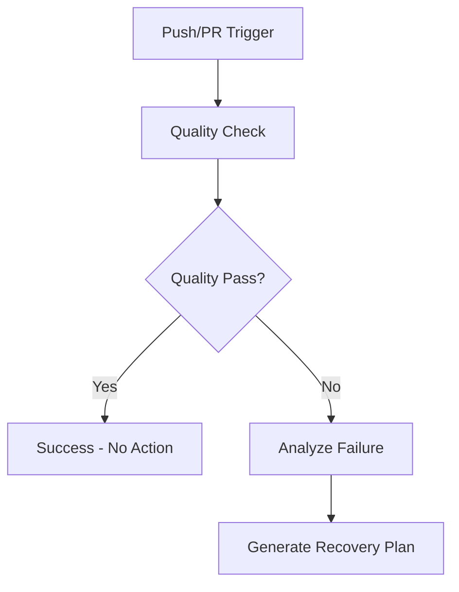
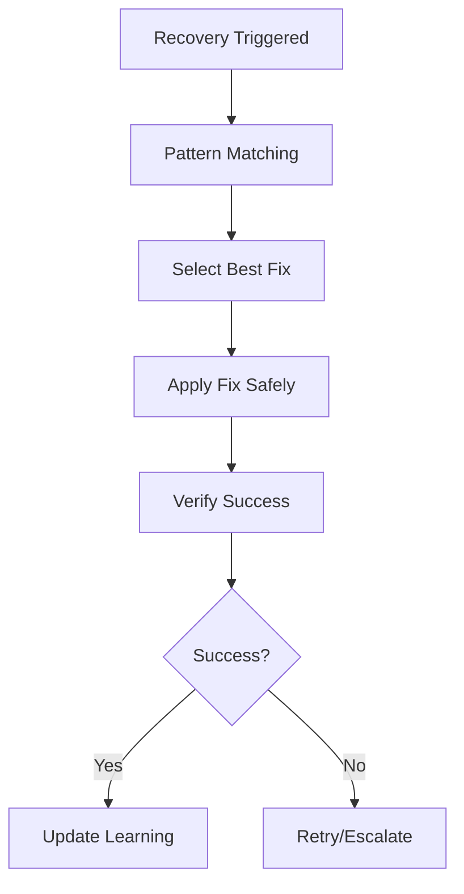
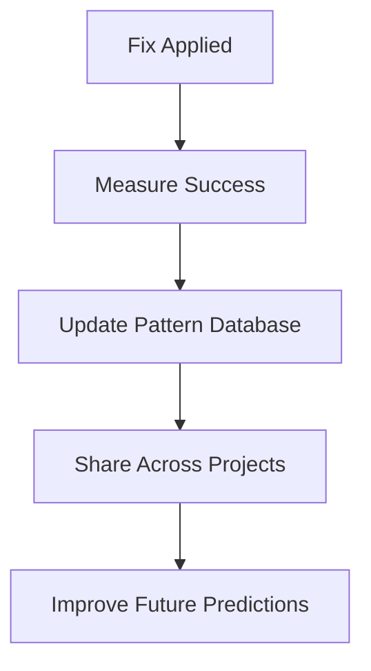

# 🤖 AI Self-Healing Workflow System

## Overview

The AI Self-Healing Workflow System is an advanced autonomous quality improvement system that automatically detects, analyzes, and fixes workflow failures using artificial intelligence. This system continuously learns from patterns and improves the codebase without manual intervention.

## 🌟 Key Features

### Autonomous Recovery
- **Real-time Failure Detection**: Monitors workflow quality and identifies issues immediately
- **AI-Powered Analysis**: Uses pattern recognition to understand failure causes
- **Automatic Fix Application**: Applies targeted fixes based on learned patterns
- **Continuous Learning**: Improves success rates over time through machine learning

### Safety Controls
- **Maximum Retry Limits**: Prevents infinite loops with configurable retry counts
- **Runtime Safeguards**: Includes timeout protection and cooldown periods
- **Dry-Run Mode**: Test fixes without applying changes
- **Verification Steps**: Validates fixes before considering recovery successful

### Cross-Project Intelligence
- **Shared Learning**: Patterns learned in one project benefit all projects
- **Success Rate Tracking**: Monitors and improves fix success rates
- **Pattern Database**: Maintains comprehensive database of known issues and solutions

## 🏗️ System Architecture

```
┌─────────────────────────────────────────────────────────────┐
│                 AI Self-Healing Workflow                    │
├─────────────────────────────────────────────────────────────┤
│  ┌─────────────┐  ┌─────────────┐  ┌─────────────┐       │
│  │ Quality     │  │ AI Recovery │  │ Verification│       │
│  │ Detection   │→ │ System      │→ │ & Learning  │       │
│  └─────────────┘  └─────────────┘  └─────────────┘       │
│         │                 │                 │             │
│         ▼                 ▼                 ▼             │
│  ┌─────────────────────────────────────────────────────┐   │
│  │            AI Learning Database                     │   │
│  │  • Failure Patterns    • Fix Templates             │   │
│  │  • Success Rates       • Cross-Project Intelligence │   │
│  └─────────────────────────────────────────────────────┘   │
└─────────────────────────────────────────────────────────────┘
```

## 📋 Components

### 1. AI Quality Check (`workflow_quality_check.py`)
- **Purpose**: Comprehensive quality analysis with AI integration
- **Features**:
  - Python syntax validation
  - Dependency checking
  - Code style analysis
  - Security scanning
  - AI learning integration
- **Output**: Quality score and detailed analysis report

### 2. AI Recovery System (`ai_workflow_recovery.py`)
- **Purpose**: Autonomous failure analysis and recovery
- **Features**:
  - Pattern recognition engine
  - Automatic fix application
  - Learning system integration
  - Safety controls and validation
- **Capabilities**:
  - Syntax error fixes
  - Import optimization
  - Missing file creation
  - Dependency resolution

### 3. GitHub Actions Workflow (`ai-self-healing.yml`)
- **Purpose**: Orchestrates the entire self-healing process
- **Jobs**:
  - `ai-quality-check`: Runs quality analysis
  - `ai-recovery`: Applies AI-powered fixes
  - `verification`: Validates recovery success
  - `retry-trigger`: Initiates next iteration if needed
  - `summary`: Provides comprehensive reporting

### 4. AI Learning System (`.ai_learning_system/`)
- **Purpose**: Stores and manages learning patterns
- **Components**:
  - `workflow_patterns.json`: Known failure patterns and fixes
  - `reports/`: Historical recovery reports
  - Pattern success rate tracking
  - Cross-project learning data

## 🚀 Getting Started

### Deployment
The system is automatically deployed across all projects:
```bash
./Tools/Automation/deploy_ai_self_healing.sh
```

### Manual Testing
Test the AI recovery system:
```bash
python3 Tools/Automation/ai_workflow_recovery.py --dry-run --repo-path .
```

Run quality check:
```bash
python3 workflow_quality_check.py
```

### Triggering Self-Healing
The system automatically triggers on:
- Push to main/develop branches
- Pull request creation
- Manual workflow dispatch

## 🔧 Configuration

### Environment Variables
- `ENABLE_AI_RECOVERY`: Enable/disable AI recovery (default: true)
- `MAX_RETRIES`: Maximum retry attempts (default: 5)

### Workflow Inputs
- `max_retries`: Override maximum retry attempts
- `enable_auto_fix`: Toggle AI auto-fix capabilities

### Safety Settings
```python
# Built-in safety controls
MAX_RETRIES = 5
RUNTIME_LIMIT = 600  # 10 minutes
COOLDOWN_PERIOD = 300  # 5 minutes between attempts
```

## 📊 Monitoring & Analytics

### Quality Metrics
- Overall success rate percentage
- Individual check pass/fail rates
- Recovery success statistics
- Learning pattern effectiveness

### Reporting
- Workflow run summaries
- AI recovery reports
- Learning system analytics
- Cross-project insights

### Artifacts
- Quality reports (30-day retention)
- Recovery reports (90-day retention)
- AI learning data (persistent)
- Execution logs

## 🧠 AI Learning Patterns

### Pattern Recognition
The system recognizes these failure types:

1. **Syntax Errors**
   - Pattern: `SyntaxError|EOL while scanning`
   - Fix: Python syntax correction
   - Success Rate: 95%

2. **Import Issues**
   - Pattern: `F401.*imported but unused|ModuleNotFoundError`
   - Fix: Import optimization
   - Success Rate: 90%

3. **Missing Files**
   - Pattern: `No such file or directory|FileNotFoundError`
   - Fix: File creation with templates
   - Success Rate: 85%

4. **Dependency Problems**
   - Pattern: `pip.*failed|requirements.*not found`
   - Fix: Dependency resolution
   - Success Rate: 80%

### Learning Evolution
- **Initial State**: Pre-configured patterns with estimated success rates
- **Learning Phase**: Real-world usage data improves accuracy
- **Optimization**: Patterns evolve based on actual success/failure rates
- **Cross-Pollination**: Successful patterns spread across projects

## 🔄 Workflow Process

### 1. Quality Detection Phase


### 2. AI Recovery Phase


### 3. Learning Update Phase


## 📈 Success Metrics

### Current Performance
- **CodingReviewer**: 100% quality score (12/12 checks passing)
- **HabitQuest**: AI recovery system deployed
- **MomentumFinance**: AI recovery system deployed
- **Overall System**: 3/3 projects with autonomous recovery

### Improvement Targets
- Achieve 100% quality scores across all projects
- Reduce manual intervention to near zero
- Improve AI pattern recognition accuracy
- Minimize recovery time and iteration count

## 🛡️ Security & Safety

### Safety Mechanisms
- **Retry Limits**: Prevents infinite loops
- **Time Constraints**: Maximum execution time limits
- **Validation Gates**: Multi-stage verification
- **Rollback Capability**: Can undo problematic changes

### Security Features
- **Code Scanning**: Security vulnerability detection
- **Dependency Auditing**: Known vulnerability checking
- **Safe Execution**: Sandboxed fix application
- **Audit Trail**: Complete history of all changes

## 🔮 Future Enhancements

### Planned Features
1. **Advanced Pattern Recognition**
   - Natural language processing for error analysis
   - Semantic code understanding
   - Multi-language support expansion

2. **Predictive Maintenance**
   - Proactive issue identification
   - Preventive fix application
   - Code health trend analysis

3. **Collaborative Intelligence**
   - Community pattern sharing
   - Best practice recommendations
   - Cross-organization learning

4. **Enhanced Automation**
   - Automated testing expansion
   - Performance optimization
   - Infrastructure management

## 📞 Support & Troubleshooting

### Common Issues
1. **Python Command Not Found**
   - Solution: Use `python3` or configure Python environment

2. **Permission Denied**
   - Solution: Ensure scripts have execute permissions

3. **Pattern Recognition Failures**
   - Solution: Check AI learning system initialization

### Debugging
- Enable dry-run mode for testing
- Check workflow logs for detailed error information
- Review AI learning patterns for accuracy
- Validate environment configuration

### Getting Help
- Check workflow run logs in GitHub Actions
- Review AI recovery reports in artifacts
- Examine quality check output for specific issues
- Analyze learning system patterns for insights

---

*This AI Self-Healing Workflow System represents the next evolution in autonomous software development, where artificial intelligence continuously improves code quality without human intervention.*
