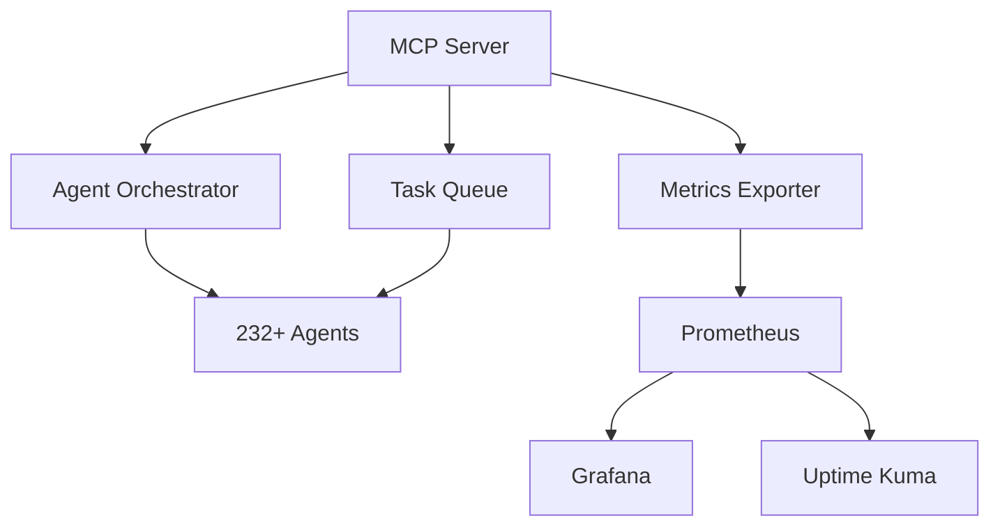

# 🎯 Developer Onboarding Guide

**Welcome to the Tools Automation project!** This comprehensive guide will get you up and running as a contributor in under 4 hours.

## 📋 Prerequisites Checklist

Before starting, ensure you have:

- [ ] **Development Environment**: macOS 10.15+ or Ubuntu 18.04+
- [ ] **Hardware**: 8GB RAM minimum, 16GB recommended
- [ ] **Network**: Stable internet connection
- [ ] **Git**: Version control system
- [ ] **Python**: 3.8+ with pip
- [ ] **Docker**: For containerized services
- [ ] **GitHub Account**: For collaboration

## 🕐 Time Estimate: 4 Hours Total

| Phase                       | Duration | Deliverables                                 |
| --------------------------- | -------- | -------------------------------------------- |
| **Environment Setup**       | 1 hour   | Working development environment              |
| **Project Familiarization** | 1 hour   | Understanding of architecture and components |
| **First Contribution**      | 1 hour   | Code changes, tests, and documentation       |
| **Advanced Topics**         | 1 hour   | CI/CD, monitoring, and best practices        |

---

## 🚀 Phase 1: Environment Setup (1 hour)

### Step 1.1: Clone and Initial Setup

```bash
# Clone the repository
git clone https://github.com/dboone323/tools-automation.git
cd tools-automation

# Create and activate virtual environment
python3 -m venv .venv
source .venv/bin/activate  # On Windows: .venv\Scripts\activate

# Install Python dependencies
pip install -r requirements.txt

# Install development tools
pip install -e .[dev]  # Install with development dependencies
```

### Step 1.2: Install System Dependencies

=== "macOS"
```bash # Install Homebrew if not present
/bin/bash -c "$(curl -fsSL https://raw.githubusercontent.com/Homebrew/install/HEAD/install.sh)"

    # Install required tools
    brew install docker docker-compose jq httpie pre-commit

    # Install Python development tools
    brew install python@3.9 pipenv

    # Start Docker Desktop
    open /Applications/Docker.app
    ```

=== "Ubuntu/Debian"
```bash # Update system
sudo apt-get update && sudo apt-get upgrade -y

    # Install Docker
    curl -fsSL https://get.docker.com -o get-docker.sh
    sudo sh get-docker.sh
    sudo usermod -aG docker $USER

    # Install development tools
    sudo apt-get install -y jq httpie python3-dev python3-pip

    # Install pre-commit
    pip3 install pre-commit
    ```

### Step 1.3: Configure Development Environment

```bash
# Install pre-commit hooks
pre-commit install

# Run initial checks on existing code
pre-commit run --all-files

# Setup git configuration
git config user.name "Your Name"
git config user.email "your.email@example.com"

# Configure git to use main branch as default
git config init.defaultBranch main
```

### Step 1.4: Start Core Services

```bash
# Start the MCP server
python3 mcp_server.py &
echo $! > mcp_server.pid

# Start monitoring stack (optional but recommended)
./monitoring.sh start

# Start metrics exporter
python3 metrics_exporter.py &
echo $! > metrics_exporter.pid
```

### Step 1.5: Verify Setup

```bash
# Test MCP server health
curl http://localhost:5005/health

# Test metrics endpoint
curl http://localhost:8080/metrics

# Run basic tests
python3 -m pytest tests/unit/test_basic.py -v

# Check pre-commit hooks
pre-commit run --all-files
```

**✅ Phase 1 Complete**: You now have a working development environment!

---

## 🏗️ Phase 2: Project Familiarization (1 hour)

### Step 2.1: Understand the Architecture

The Tools Automation project consists of several key components:

#### Core Components



#### Key Directories

- **`mcp_server.py`**: Main HTTP API server (port 5005)
- **`agents/`**: 232+ automation agents
- **`metrics_exporter.py`**: Prometheus metrics endpoint (port 8080)
- **`docs/`**: MkDocs documentation
- **`tests/`**: Comprehensive test suite
- **`workflows/`**: CI/CD automation scripts

### Step 2.2: Explore the Codebase

```bash
# Get repository statistics
find . -name "*.py" -o -name "*.sh" -o -name "*.md" | wc -l
find . -name "*.py" | xargs wc -l | tail -1

# Explore key files
head -50 mcp_server.py          # Main server
head -50 shared_functions.sh     # Common utilities
ls agents/ | head -20           # Available agents
```

### Step 2.3: Understand the Agent System

```bash
# List all available agents
ls agents/*.sh | wc -l

# Check agent capabilities
grep -r "AGENT_CAPABILITIES" agents/ | head -10

# View agent status
cat agent_status.json | jq '.agents | keys | length'

# Check running agents
ps aux | grep -E "agent_|testing_|build_" | grep -v grep
```

### Step 2.4: Review Documentation Structure

```bash
# Start documentation server
cd docs && python3 -m mkdocs serve &
echo $! > mkdocs.pid

# Open documentation in browser
open http://localhost:8000

# Review key documentation files
cat docs/README.md
cat docs/ARCHITECTURE.md
cat docs/API_REFERENCE.md
```

### Step 2.5: Run the Test Suite

```bash
# Run unit tests
python3 -m pytest tests/unit/ -v --tb=short

# Run integration tests
python3 -m pytest tests/integration/ -v --tb=short

# Check test coverage
python3 -m pytest --cov=. --cov-report=html
open htmlcov/index.html
```

**✅ Phase 2 Complete**: You now understand the project architecture and components!

---

## 💻 Phase 3: First Contribution (1 hour)

### Step 3.1: Choose Your First Task

Select from these beginner-friendly tasks:

#### Option A: Documentation Improvement

- Fix typos in documentation
- Add missing examples
- Improve code comments

#### Option B: Test Enhancement

- Add unit tests for uncovered functions
- Improve test coverage
- Add integration tests

#### Option C: Agent Enhancement

- Add logging to an agent
- Improve error handling
- Add new agent capabilities

#### Option D: Bug Fix

- Fix a reported issue
- Improve error messages
- Add input validation

### Step 3.2: Create a Feature Branch

```bash
# Create and switch to feature branch
git checkout -b feature/your-feature-name

# Verify branch
git branch
```

### Step 3.3: Implement Your Changes

Example: Add a simple utility function

```bash
# Create a new utility function in shared_functions.sh
echo '
# Get current timestamp in ISO format
get_iso_timestamp() {
    date -u +"%Y-%m-%dT%H:%M:%SZ"
}
' >> shared_functions.sh

# Export the new function
echo 'export -f get_iso_timestamp' >> shared_functions.sh
```

### Step 3.4: Write Tests

```bash
# Create test file
cat > tests/unit/test_timestamp.py << 'EOF'
import subprocess
import pytest

def test_get_iso_timestamp():
    """Test ISO timestamp generation"""
    result = subprocess.run(
        ['bash', '-c', 'source shared_functions.sh && get_iso_timestamp'],
        capture_output=True,
        text=True,
        cwd='.'
    )

    assert result.returncode == 0
    assert 'T' in result.stdout.strip()
    assert 'Z' in result.stdout.strip()

def test_timestamp_format():
    """Test timestamp format compliance"""
    result = subprocess.run(
        ['bash', '-c', 'source shared_functions.sh && get_iso_timestamp'],
        capture_output=True,
        text=True,
        cwd='.'
    )

    timestamp = result.stdout.strip()
    # Should match ISO 8601 format
    assert len(timestamp) == 20  # YYYY-MM-DDTHH:MM:SSZ
    assert timestamp[4] == '-'
    assert timestamp[7] == '-'
    assert timestamp[10] == 'T'
    assert timestamp[13] == ':'
    assert timestamp[16] == ':'
    assert timestamp[19] == 'Z'
EOF
```

### Step 3.5: Run Tests and Quality Checks

```bash
# Run your new tests
python3 -m pytest tests/unit/test_timestamp.py -v

# Run pre-commit checks
pre-commit run --all-files

# Run integration tests to ensure nothing broke
python3 -m pytest tests/integration/ -x
```

### Step 3.6: Update Documentation

````bash
# Add documentation for your new function
cat >> docs/API_REFERENCE.md << 'EOF'

### get_iso_timestamp()

Get current timestamp in ISO 8601 format.

**Usage:**
```bash
source shared_functions.sh
timestamp=$(get_iso_timestamp)
echo "Current time: $timestamp"
````

**Returns:** ISO 8601 formatted timestamp string (e.g., "2025-11-12T10:30:45Z")

**Example Output:**

```
2025-11-12T10:30:45Z
```

EOF

````

### Step 3.7: Commit and Push

```bash
# Check status
git status

# Add your changes
git add .

# Commit with descriptive message
git commit -m "feat: Add get_iso_timestamp utility function

- Add ISO 8601 timestamp generation function
- Include comprehensive unit tests
- Update API documentation
- Pass all quality checks"

# Push to your branch
git push origin feature/your-feature-name
````

### Step 3.8: Create Pull Request

1. Go to GitHub repository
2. Click "Compare & pull request"
3. Fill out PR template:
   - **Title**: `feat: Add get_iso_timestamp utility function`
   - **Description**: Describe what you implemented and why
   - **Checklist**: Ensure all items are checked
4. Request review from maintainers

**✅ Phase 3 Complete**: You've made your first contribution!

---

## 🎓 Phase 4: Advanced Topics (1 hour)

### Step 4.1: CI/CD Pipeline

```bash
# View CI configuration
cat .github/workflows/ci.yml

# Run CI checks locally
act -j test

# Check CI status
gh run list --limit 5
```

### Step 4.2: Monitoring and Observability

```bash
# Start monitoring stack
./monitoring.sh start

# View metrics
curl http://localhost:8080/metrics

# Access Grafana
open http://localhost:3000  # admin/admin

# Check agent health
curl http://localhost:5005/health | jq .
```

### Step 4.3: Performance Optimization

```bash
# Run performance benchmarks
python3 run_performance_benchmarks.py

# Profile a script
python3 -m cProfile mcp_server.py --help

# Check memory usage
python3 -c "import psutil; print(f'Memory: {psutil.virtual_memory().percent}%')"
```

### Step 4.4: Security Best Practices

```bash
# Run security scan
./security_scan.sh audit

# Check dependencies
pip-audit

# Review permissions
find . -type f -perm 777  # Should return nothing
```

### Step 4.5: Code Quality Tools

```bash
# Run comprehensive quality checks
./quality.sh analyze

# Check test coverage
./run_coverage_audit.sh

# Validate documentation
./docs.sh build
```

### Step 4.6: Deployment and Production

```bash
# Test production deployment
./production_deployment_validation.sh

# Check system health
./run_comprehensive_system_test.sh

# Validate configuration
./validate_openapi_spec.py
```

**✅ Phase 4 Complete**: You're now an advanced contributor!

---

## 🏆 Achievement Unlocked: Full Contributor Status

Congratulations! You've completed the comprehensive onboarding process and are now ready to contribute effectively to the Tools Automation project.

### What You've Accomplished

- ✅ **Environment Setup**: Working development environment with all tools
- ✅ **Architecture Understanding**: Deep knowledge of system components
- ✅ **Code Contribution**: Successfully implemented, tested, and documented a feature
- ✅ **Quality Assurance**: Experience with testing, CI/CD, and code quality tools
- ✅ **Best Practices**: Knowledge of monitoring, security, and performance optimization

### Next Steps for Continued Growth

1. **Regular Contributions**: Continue making PRs and engaging with the community
2. **Review Process**: Start reviewing other contributors' PRs
3. **Mentorship**: Help onboard new contributors
4. **Advanced Features**: Tackle complex features and architectural improvements
5. **Community Leadership**: Participate in discussions and help shape project direction

### Resources for Continued Learning

- **Documentation**: [Full API Reference](../API_REFERENCE.md)
- **Architecture**: [System Architecture](../ARCHITECTURE.md)
- **Contributing**: [Contributing Guide](../about/contributing.md)
- **Issues**: [GitHub Issues](https://github.com/dboone323/tools-automation/issues)
- **Discussions**: [GitHub Discussions](https://github.com/dboone323/tools-automation/discussions)

### Recognition and Impact

Your contributions help make development automation accessible to everyone. Every line of code, test, and documentation improves the experience for the entire development community.

**Welcome to the Tools Automation contributor community!** 🎉

---

## 📞 Getting Help

### Immediate Help

- **Documentation**: Search our [comprehensive docs](../index.md)
- **Issues**: Check existing [GitHub Issues](https://github.com/dboone323/tools-automation/issues)
- **Discussions**: Ask questions in [GitHub Discussions](https://github.com/dboone323/tools-automation/discussions)

### Community Support

- **Slack**: Join our [community Slack](https://tools-automation.slack.com) (invite link in discussions)
- **Discord**: Chat with contributors on [Discord](https://discord.gg/tools-automation)
- **Office Hours**: Weekly community calls (check discussions for schedule)

### Technical Support

- **Code Reviews**: Get feedback on your PRs
- **Pair Programming**: Schedule sessions with maintainers
- **Mentorship**: Connect with experienced contributors

---

_Built with ❤️ for the development community_

**Last updated: November 12, 2025**</content>
<parameter name="filePath">/Users/danielstevens/Desktop/github-projects/tools-automation/docs/getting-started/onboarding.md
