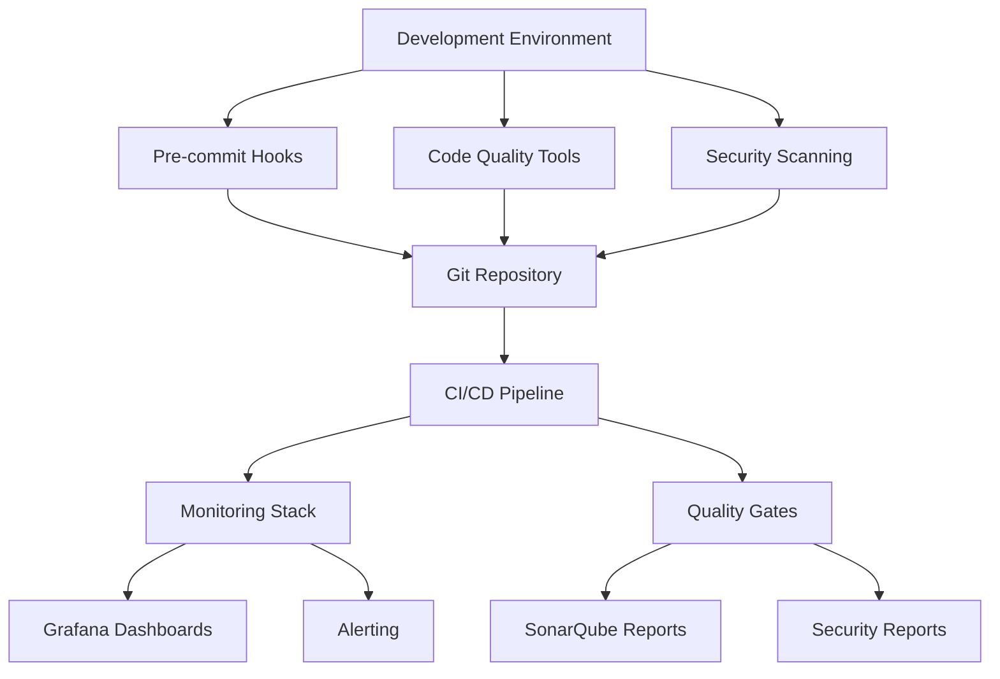

# 🛠️ Tools Automation Project

**A comprehensive suite of free tools for development workflow automation, monitoring, security scanning, and quality assurance.**

[](https://github.com/dboone323/tools-automation)
[](LICENSE)
[](https://hub.docker.com)

## 🚀 Quick Start

Get started with the Tools Automation project in minutes:

```bash
# Clone the repository
git clone https://github.com/dboone323/tools-automation.git
cd tools-automation

# Install all tools
./setup_tools.sh --all

# Start monitoring stack
./monitoring.sh start

# Start metrics exporter
python3 metrics_exporter.py
```

Access your monitoring dashboard at [http://localhost:3000](http://localhost:3000) (admin/admin).

## 📊 What You Get

### 🔍 **Monitoring & Observability**

- **Prometheus**: Metrics collection and alerting
- **Grafana**: Beautiful dashboards and visualizations
- **Uptime Kuma**: Service uptime monitoring
- **Node Exporter**: System metrics collection
- **Custom Metrics Exporter**: Agent performance monitoring

### 🧪 **Code Quality & Security**

- **SonarQube**: Comprehensive code analysis
- **Trivy**: Container vulnerability scanning
- **Snyk**: Dependency vulnerability management
- **Pre-commit**: Automated code quality checks

### 📚 **Documentation & Development**

- **MkDocs**: Professional documentation site
- **Pre-commit Hooks**: Code quality enforcement
- **Development Tools**: HTTPie, jq, and more

## 🏗️ Architecture Overview



## 📖 Documentation Sections

### [Getting Started](getting-started/quick-start.md)

- [Quick Start Guide](getting-started/quick-start.md)
- [Installation](getting-started/installation.md)
- [Configuration](getting-started/configuration.md)

### [Tools & Features](tools/monitoring.md)

- [Monitoring Stack](tools/monitoring.md)
- [Quality Tools](tools/quality.md)
- [Security Scanning](tools/security.md)
- [Development Tools](tools/development.md)

### [API Documentation](api/metrics.md)

- [Metrics API](api/metrics.md)
- [Agent API](api/agents.md)
- [Webhooks](api/webhooks.md)

### [Tutorials](tutorials/monitoring-setup.md)

- [Setting up Monitoring](tutorials/monitoring-setup.md)
- [Code Quality Analysis](tutorials/code-quality.md)
- [Security Scanning](tutorials/security-scanning.md)
- [Custom Dashboards](tutorials/custom-dashboards.md)

### [Reference](reference/configuration.md)

- [Configuration Files](reference/configuration.md)
- [Environment Variables](reference/environment.md)
- [Troubleshooting](reference/troubleshooting.md)
- [FAQ](reference/faq.md)

## 🎯 Key Features

### ✅ **Free & Open Source**

All tools are completely free with no hidden costs or usage limits.

### 🔧 **Easy Setup**

Automated installation scripts get you up and running quickly.

### 📈 **Comprehensive Monitoring**

Real-time visibility into system performance and agent health.

### 🛡️ **Security First**

Automated vulnerability scanning and dependency management.

### 📚 **Professional Documentation**

Beautiful, searchable documentation powered by MkDocs.

### 🔄 **CI/CD Integration**

Seamless integration with GitHub Actions and other CI/CD platforms.

## 🏆 Use Cases

### **Development Teams**

- Automate code quality checks
- Monitor development environment health
- Track team productivity metrics

### **DevOps Engineers**

- Container security scanning
- Infrastructure monitoring
- Automated deployment validation

### **Open Source Projects**

- Community contribution quality gates
- Project health monitoring
- Automated release processes

### **Individual Developers**

- Personal development environment monitoring
- Code quality improvement
- Learning and experimentation platform

## 🤝 Contributing

We welcome contributions! See our [Contributing Guide](about/contributing.md) for details.

### Quick Ways to Contribute

- 🐛 **Report Issues**: Found a bug? [Open an issue](https://github.com/dboone323/tools-automation/issues)
- 💡 **Suggest Features**: Have an idea? [Start a discussion](https://github.com/dboone323/tools-automation/discussions)
- 📖 **Improve Documentation**: Help make our docs better
- 🧪 **Add Tests**: Increase our test coverage

## 📄 License

This project is licensed under the MIT License - see the [LICENSE](about/license.md) file for details.

## 🙏 Acknowledgments

- [Prometheus](https://prometheus.io/) - Metrics collection
- [Grafana](https://grafana.com/) - Visualization
- [SonarQube](https://www.sonarsource.com/products/sonarqube/) - Code quality
- [Trivy](https://aquasecurity.github.io/trivy/) - Security scanning
- [MkDocs](https://www.mkdocs.org/) - Documentation

---

_Built with ❤️ for the development community_

**Last updated: November 11, 2025**
