# 🔧 Troubleshooting Guide

**Comprehensive troubleshooting guide with decision trees for diagnosing and resolving common issues in the Tools Automation system.**

## 📋 Quick Reference

| Issue Category             | Quick Fix                        | Full Guide                                |
| -------------------------- | -------------------------------- | ----------------------------------------- |
| **MCP Server won't start** | Check Python dependencies        | [Server Issues](#mcp-server-issues)       |
| **Agents not responding**  | Check task orchestrator          | [Agent Issues](#agent-issues)             |
| **Tests failing**          | Run `pre-commit run --all-files` | [Testing Issues](#testing-issues)         |
| **Monitoring not working** | Check Docker services            | [Monitoring Issues](#monitoring-issues)   |
| **Performance problems**   | Check resource usage             | [Performance Issues](#performance-issues) |

---

## 🏥 MCP Server Issues

### Server Won't Start

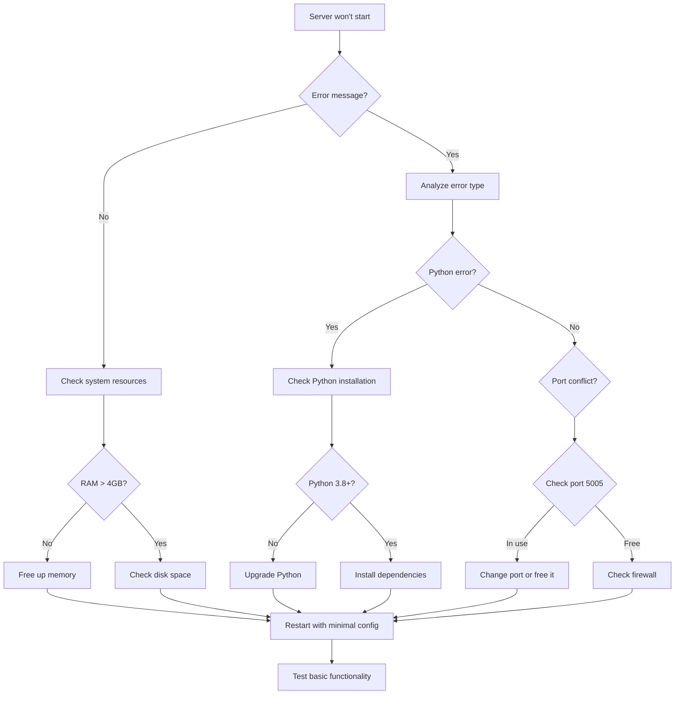

#### Step-by-Step Resolution

1. **Check System Resources**

   ```bash
   # Check memory
   free -h  # Linux
   vm_stat   # macOS

   # Check disk space
   df -h

   # Check CPU load
   top -l 1 | head -10
   ```

2. **Verify Python Environment**

   ```bash
   # Check Python version
   python3 --version

   # Check pip installation
   pip3 --version

   # Verify virtual environment
   which python3
   echo $VIRTUAL_ENV
   ```

3. **Install Dependencies**

   ```bash
   # Activate virtual environment
   source .venv/bin/activate

   # Install requirements
   pip install -r requirements.txt

   # Check for missing packages
   python3 -c "import flask, aiohttp, redis; print('All imports OK')"
   ```

4. **Check Port Availability**

   ```bash
   # Check if port 5005 is in use
   lsof -i :5005

   # Find process using port
   netstat -tulpn | grep :5005

   # Kill conflicting process (if safe)
   kill -9 <PID>
   ```

5. **Test Basic Functionality**

   ```bash
   # Start server with debug mode
   python3 mcp_server.py --debug

   # Test health endpoint
   curl http://localhost:5005/health

   # Check server logs
   tail -f mcp_server.log
   ```

### Server Returns 503 Errors

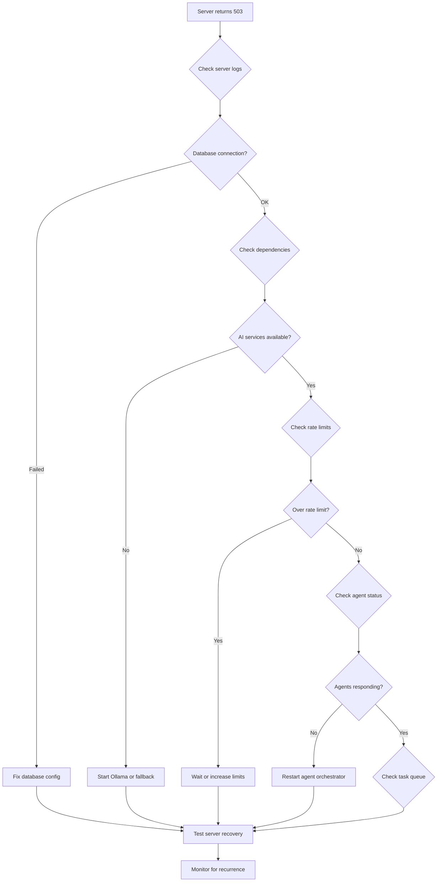

#### Resolution Steps

1. **Check Server Logs**

   ```bash
   # View recent logs
   tail -50 mcp_server.log

   # Search for errors
   grep -i error mcp_server.log | tail -10

   # Check for specific error patterns
   grep -i "connection\|timeout\|rate" mcp_server.log
   ```

2. **Verify Dependencies**

   ```bash
   # Check Redis connection
   redis-cli ping

   # Test AI service availability
   curl http://localhost:11434/api/tags

   # Verify database connectivity
   python3 -c "import redis; r = redis.Redis(); r.ping()"
   ```

3. **Check Rate Limits**

   ```bash
   # View current rate limit status
   curl http://localhost:5005/status | jq '.rate_limits'

   # Check rate limit configuration
   cat config/automation_config.yaml | grep -A 10 rate_limit

   # Reset rate limits if needed (development only)
   redis-cli FLUSHALL
   ```

4. **Restart Services**

   ```bash
   # Restart MCP server
   pkill -f mcp_server
   python3 mcp_server.py &

   # Restart agent orchestrator
   pkill -f task_orchestrator
   ./agents/task_orchestrator.sh &
   ```

### High Latency Issues

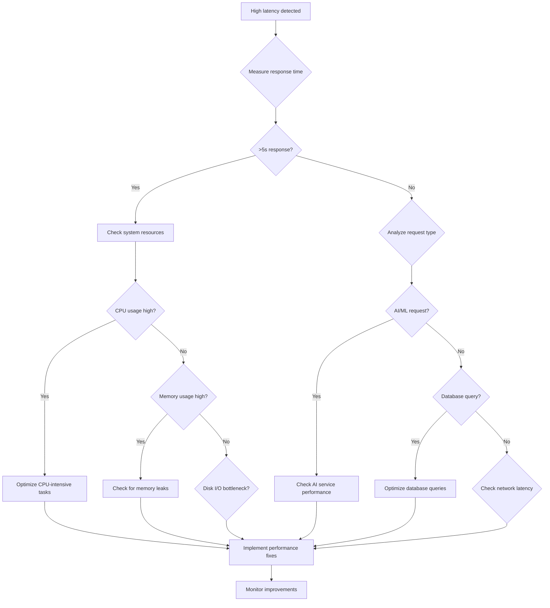

#### Performance Optimization Steps

1. **Measure Current Performance**

   ```bash
   # Use Apache Bench for load testing
   ab -n 100 -c 10 http://localhost:5005/health

   # Check response times
   curl -w "@curl-format.txt" -o /dev/null http://localhost:5005/health

   # Monitor with Prometheus metrics
   curl http://localhost:8080/metrics | grep response_time
   ```

2. **Resource Analysis**

   ```bash
   # CPU usage
   top -l 1 | grep Python

   # Memory usage
   ps aux | grep mcp_server | grep -v grep

   # Disk I/O
   iostat -x 1 5

   # Network
   netstat -i
   ```

3. **Database Optimization**

   ```bash
   # Check Redis performance
   redis-cli --latency

   # Analyze slow queries
   redis-cli MONITOR | head -20

   # Check connection pool
   redis-cli INFO | grep connected_clients
   ```

4. **AI Service Optimization**

   ```bash
   # Check Ollama performance
   curl http://localhost:11434/api/generate -X POST \
     -d '{"model":"llama2","prompt":"test","stream":false}' \
     -w "@curl-format.txt" -o /dev/null

   # Monitor AI service resources
   docker stats ollama
   ```

---

## 🤖 Agent Issues

### Agents Not Executing Tasks

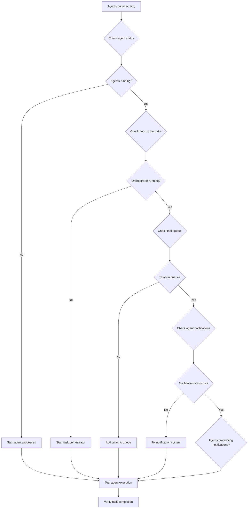

#### Agent Troubleshooting Steps

1. **Check Agent Status**

   ```bash
   # List running agents
   ps aux | grep -E "agent_|testing_" | grep -v grep

   # Check agent status file
   cat agent_status.json | jq '.agents | to_entries[] | select(.value.status != "stopped")'

   # View agent logs
   ls agents/*.log | head -5
   tail -20 agents/testing_agent.log
   ```

2. **Verify Task Orchestrator**

   ```bash
   # Check if orchestrator is running
   ps aux | grep task_orchestrator | grep -v grep

   # Check orchestrator logs
   tail -30 agents/task_orchestrator.log

   # Verify task queue
   jq '.tasks | length' task_queue.json
   jq '.tasks[] | select(.status == "queued") | .id' task_queue.json | head -5
   ```

3. **Check Notification System**

   ```bash
   # Check notification files
   ls -la communication/

   # View recent notifications
   find communication/ -name "*.txt" -exec wc -l {} \; | sort -nr

   # Check specific agent notifications
   tail -10 communication/testing_agent.sh_notification.txt
   ```

4. **Test Agent Execution**

   ```bash
   # Manually trigger agent
   echo "1732907461|execute_task|test_task_123" >> communication/testing_agent.sh_notification.txt

   # Monitor agent response
   tail -f agents/testing_agent.log

   # Check task completion
   jq '.tasks[] | select(.id == "test_task_123")' task_queue.json
   ```

### Agent Crashes or Errors

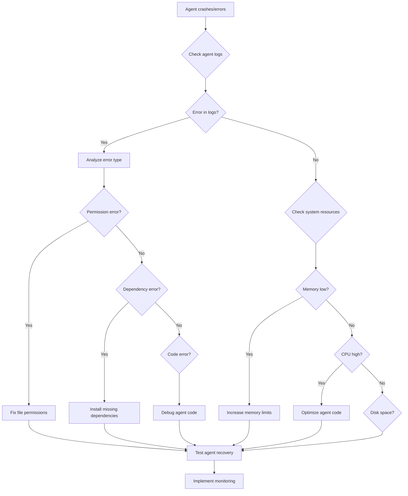

#### Agent Error Resolution

1. **Analyze Agent Logs**

   ```bash
   # Check recent errors
   grep -i error agents/*.log | tail -10

   # View specific agent logs
   tail -50 agents/testing_agent.log

   # Search for crash patterns
   grep -A 5 -B 5 "Traceback\|Exception" agents/*.log
   ```

2. **Check System Resources**

   ```bash
   # Memory usage
   ps aux --sort=-%mem | head -10

   # CPU usage
   ps aux --sort=-%cpu | head -10

   # Disk space
   df -h

   # Check agent resource limits
   cat /etc/security/limits.conf | grep agent
   ```

3. **Fix Dependencies**

   ```bash
   # Check Python imports
   python3 -c "import sys; print(sys.path)"

   # Verify agent dependencies
   grep "import\|source" agents/testing_agent.sh

   # Install missing packages
   pip install missing-package
   ```

4. **Debug Agent Code**

   ```bash
   # Enable debug logging
   export AGENT_DEBUG=1

   # Run agent manually
   bash agents/testing_agent.sh

   # Test individual functions
   source shared_functions.sh
   get_next_task
   ```

---

## 🧪 Testing Issues

### Tests Failing

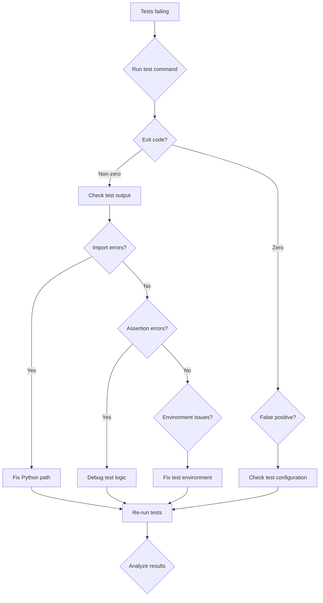

#### Test Debugging Steps

1. **Run Tests with Verbose Output**

   ```bash
   # Run specific test with details
   python3 -m pytest tests/unit/test_basic.py -v -s

   # Run with traceback
   python3 -m pytest tests/unit/test_basic.py --tb=long

   # Run single test function
   python3 -m pytest tests/unit/test_basic.py::test_function_name -v
   ```

2. **Check Test Environment**

   ```bash
   # Verify Python path
   python3 -c "import sys; print('\n'.join(sys.path))"

   # Check test dependencies
   pip list | grep pytest

   # Verify test configuration
   cat pytest.ini
   ```

3. **Debug Import Issues**

   ```bash
   # Test imports manually
   python3 -c "import mcp_server; print('Import OK')"

   # Check module location
   python3 -c "import mcp_server; print(mcp_server.__file__)"

   # Add current directory to path
   PYTHONPATH=. python3 -m pytest tests/
   ```

4. **Fix Common Test Issues**

   ```bash
   # Clear pytest cache
   python3 -m pytest --cache-clear

   # Update test dependencies
   pip install -r requirements-dev.txt

   # Check for file permissions
   find tests/ -type f -exec ls -la {} \; | grep -v rw-
   ```

### Coverage Issues

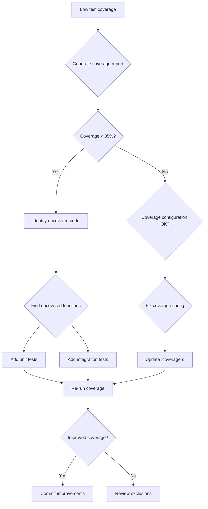

#### Coverage Improvement Steps

1. **Generate Coverage Report**

   ```bash
   # Run tests with coverage
   python3 -m pytest --cov=. --cov-report=html --cov-report=term

   # View HTML report
   open htmlcov/index.html

   # Check coverage by module
   python3 -m pytest --cov=. --cov-report=term-missing
   ```

2. **Identify Uncovered Code**

   ```bash
   # Find uncovered functions
   python3 -m pytest --cov=. --cov-report=html
   grep -r "class\|def" *.py | grep -v test_ | head -20

   # Check specific file coverage
   python3 -m pytest --cov=mcp_server --cov-report=term-missing
   ```

3. **Add Missing Tests**

   ```bash
   # Create test template
   cat > tests/unit/test_new_module.py << 'EOF'
   import pytest
   from module_name import function_name

   def test_function_name():
       """Test function_name behavior"""
       result = function_name()
       assert result is not None

   def test_function_name_edge_cases():
       """Test function_name edge cases"""
       # Add edge case tests
       pass
   EOF
   ```

---

## 📊 Monitoring Issues

### Grafana Not Loading

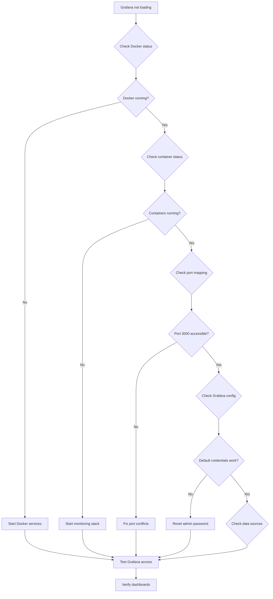

#### Monitoring Setup Steps

1. **Check Docker Services**

   ```bash
   # Check Docker daemon
   docker info

   # List running containers
   docker ps

   # Check monitoring containers
   docker ps | grep -E "grafana|prometheus|uptime"
   ```

2. **Start Monitoring Stack**

   ```bash
   # Start all services
   ./monitoring.sh start

   # Check service logs
   ./monitoring.sh logs grafana

   # Verify port availability
   netstat -tulpn | grep :3000
   ```

3. **Configure Grafana**

   ```bash
   # Access Grafana
   open http://localhost:3000

   # Login with admin/admin
   # Change password on first login

   # Add Prometheus data source
   # URL: http://prometheus:9090
   ```

4. **Import Dashboards**

   ```bash
   # Import dashboard JSON
   cat monitoring/dashboards/system_overview.json

   # Set up alerts
   cat monitoring/alerts/rules.yml
   ```

### Metrics Not Appearing

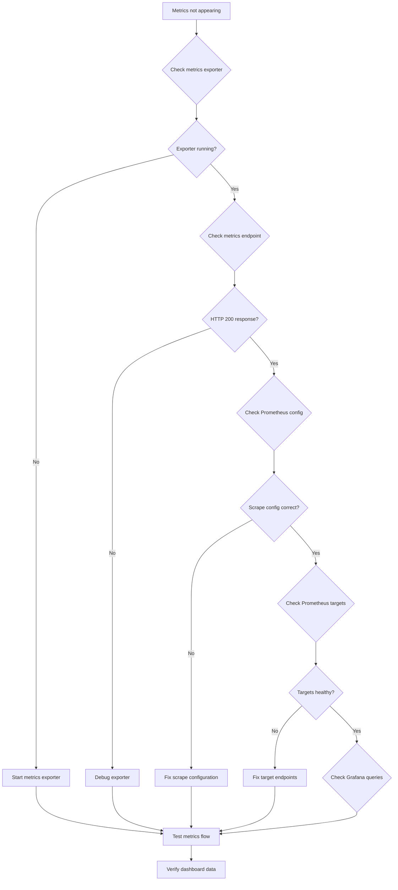

#### Metrics Troubleshooting

1. **Check Metrics Exporter**

   ```bash
   # Start metrics exporter
   python3 metrics_exporter.py &
   echo $! > metrics_exporter.pid

   # Test metrics endpoint
   curl http://localhost:8080/metrics

   # Check exporter logs
   tail -f metrics_exporter.log
   ```

2. **Verify Prometheus Configuration**

   ```bash
   # Check Prometheus config
   cat monitoring/prometheus.yml

   # Reload configuration
   curl -X POST http://localhost:9090/-/reload

   # Check targets
   curl http://localhost:9090/api/v1/targets
   ```

3. **Debug Grafana Queries**

   ```bash
   # Test Prometheus query
   curl "http://localhost:9090/api/v1/query?query=up"

   # Check Grafana data sources
   # Configuration > Data Sources > Prometheus

   # Test query in Grafana
   # Query: up{job="mcp_server"}
   ```

---

## ⚡ Performance Issues

### High Memory Usage

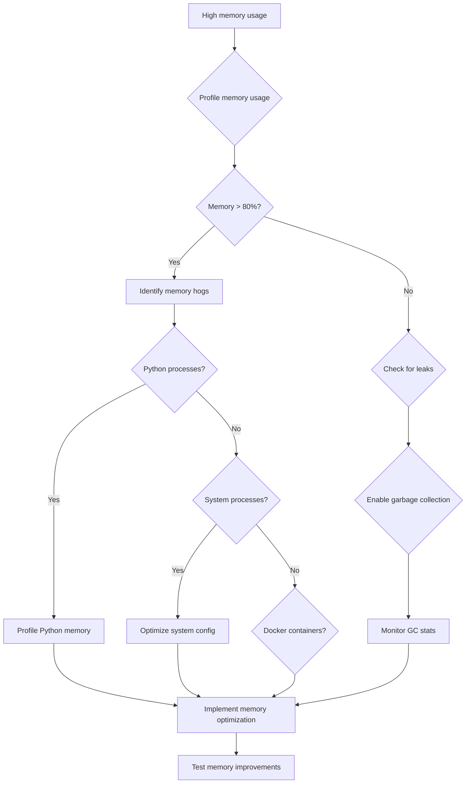

#### Memory Optimization Steps

1. **Profile Memory Usage**

   ```bash
   # Check system memory
   free -h
   vm_stat  # macOS

   # Profile Python processes
   python3 -c "import psutil; print(psutil.virtual_memory())"

   # Check process memory
   ps aux --sort=-%mem | head -10
   ```

2. **Profile Python Memory**

   ```bash
   # Use memory profiler
   pip install memory-profiler
   python3 -m memory_profiler mcp_server.py

   # Check for memory leaks
   python3 -c "
   import gc
   import mcp_server
   print(f'Objects: {len(gc.get_objects())}')
   gc.collect()
   print(f'After GC: {len(gc.get_objects())}')
   "
   ```

3. **Optimize Memory Usage**

   ```bash
   # Implement lazy loading
   # Use generators instead of lists
   # Cache with TTL
   # Profile and optimize data structures

   # Example optimization
   cat > memory_optimization.py << 'EOF'
   import weakref
   from functools import lru_cache

   # Use LRU cache for expensive operations
   @lru_cache(maxsize=1000)
   def cached_expensive_operation(data):
       return expensive_computation(data)

   # Use weak references for large objects
   large_objects = weakref.WeakValueDictionary()
   EOF
   ```

### Slow Response Times

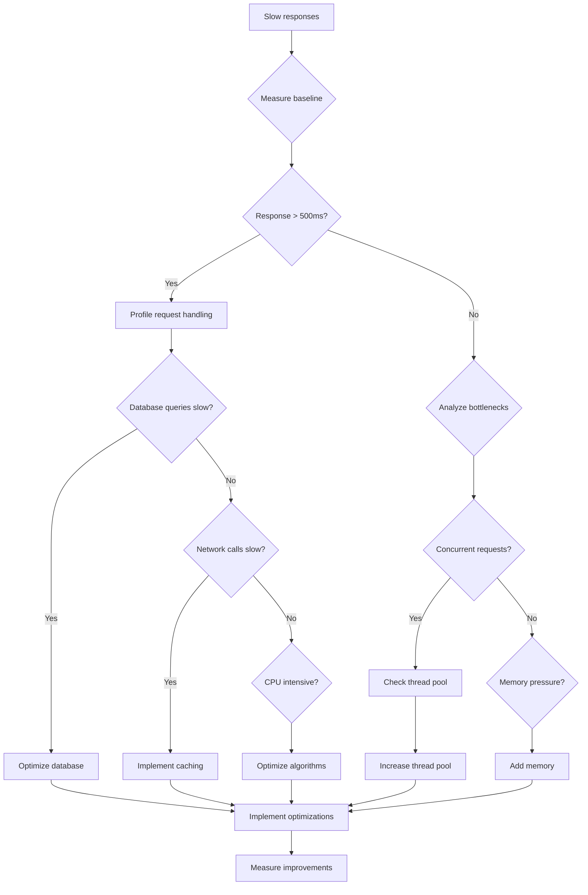

#### Performance Tuning Steps

1. **Measure Performance Baseline**

   ```bash
   # Use Apache Bench
   ab -n 1000 -c 50 http://localhost:5005/health

   # Use wrk for more advanced testing
   wrk -t 4 -c 100 -d 30s http://localhost:5005/health

   # Profile with cProfile
   python3 -m cProfile -s time mcp_server.py
   ```

2. **Identify Bottlenecks**

   ```bash
   # Profile database queries
   # Add timing decorators
   cat > profiling_decorator.py << 'EOF'
   import time
   from functools import wraps

   def timing_decorator(func):
       @wraps(func)
       def wrapper(*args, **kwargs):
           start = time.time()
           result = func(*args, **kwargs)
           end = time.time()
           print(f"{func.__name__} took {end - start:.2f} seconds")
           return result
       return wrapper
   EOF
   ```

3. **Implement Optimizations**

   ```bash
   # Add Redis caching
   pip install redis

   # Implement connection pooling
   # Use async/await for I/O operations
   # Optimize database queries
   # Add CDN for static assets
   ```

---

## 🚨 Emergency Procedures

### Complete System Failure

1. **Immediate Actions**

   ```bash
   # Stop all services
   ./emergency_stop.sh

   # Backup current state
   ./create_emergency_backup.sh

   # Check system resources
   ./system_health_check.sh
   ```

2. **Recovery Steps**

   ```bash
   # Start minimal services
   ./minimal_startup.sh

   # Restore from backup
   ./emergency_restore.sh

   # Validate system integrity
   ./comprehensive_system_test.sh
   ```

3. **Post-Mortem**

   ```bash
   # Analyze logs
   ./log_analysis.sh

   # Generate incident report
   ./incident_report.sh

   # Implement fixes
   ./emergency_fixes.sh
   ```

### Data Loss Recovery

1. **Assess Damage**

   ```bash
   # Check data integrity
   ./data_integrity_check.sh

   # Identify missing data
   ./data_audit.sh
   ```

2. **Recovery Options**

   ```bash
   # Restore from backups
   ./restore_from_backup.sh

   # Rebuild from source
   ./rebuild_data.sh

   # Sync from replicas
   ./sync_from_replica.sh
   ```

---

## 📞 Getting Help

### Community Resources

- **GitHub Issues**: [Report bugs](https://github.com/dboone323/tools-automation/issues)
- **GitHub Discussions**: [Ask questions](https://github.com/dboone323/tools-automation/discussions)
- **Slack Community**: Join our [Slack workspace](https://tools-automation.slack.com)
- **Documentation**: [Full troubleshooting docs](../reference/troubleshooting.md)

### Professional Support

- **Enterprise Support**: Contact [enterprise@tools-automation.com](mailto:enterprise@tools-automation.com)
- **Consulting Services**: Schedule a [consultation call](https://calendly.com/tools-automation)
- **Training Workshops**: Join our [training sessions](https://tools-automation.com/training)

### Debug Information Collection

When reporting issues, please include:

```bash
# System information
uname -a
python3 --version
docker --version

# Service status
./status_check.sh

# Recent logs
tail -100 mcp_server.log
tail -50 agents/task_orchestrator.log

# Configuration
cat config/automation_config.yaml | grep -v password
```

---

_Built with ❤️ for reliable automation_

**Last updated: November 12, 2025**</content>
<parameter name="filePath">/Users/danielstevens/Desktop/github-projects/tools-automation/docs/reference/troubleshooting.md
